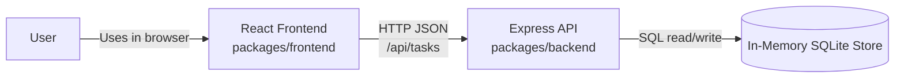
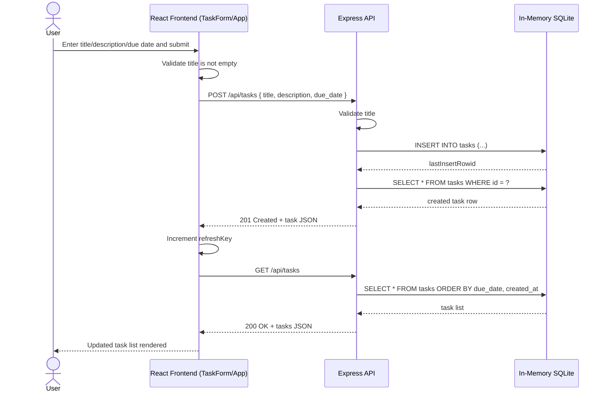

# Cloud Architecture Overview

This document provides a simple cloud/system context for the TODO monorepo and a request sequence for creating a TODO.

## System Context

## Sequence: User Creates a TODO

## Assumptions and Constraints

- This architecture reflects the current monorepo implementation and is intended for development/local runtime.
- Task data is stored in an in-memory SQLite database (`:memory:`), so all task data is lost when the backend process restarts.
- The system is a single backend service boundary (Express API) with no external queue, cache, or separate database service.
- The frontend communicates with the backend using JSON over HTTP at `/api/tasks` endpoints.
- No authentication/authorization flow is currently implemented in the frontend or backend code paths.